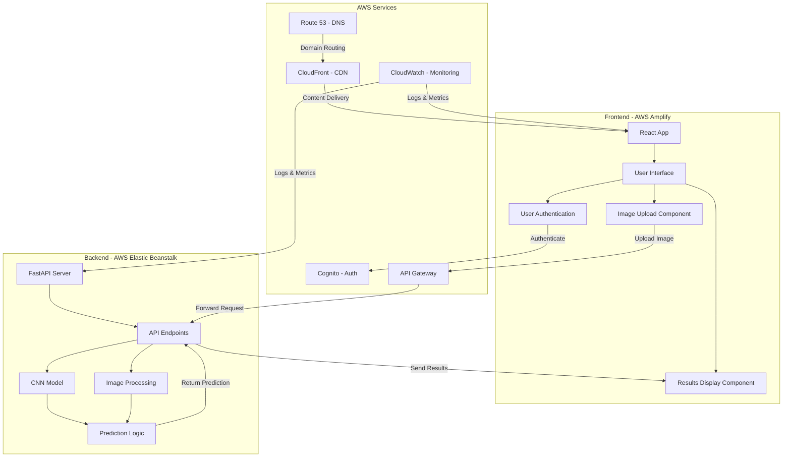

# 210-Capstone

Files, version control and an auxiliary base for documents outside of the Google Drive. 

```mermaid
flowchart TD
    subgraph "Frontend - AWS Amplify"
        A[React App]
        B[User Interface]
        C[Image Upload Component]
        D[Results Display Component]
        E[User Authentication]
    end

    subgraph "Backend - AWS Elastic Beanstalk"
        F[FastAPI Server]
        G[API Endpoints]
        H[CNN Model]
        I[Image Processing]
        J[Prediction Logic]
    end

    subgraph "AWS Services"
        K[Route 53 - DNS]
        L[CloudFront - CDN]
        N[Cognito - Auth]
        O[API Gateway]
        P[CloudWatch - Monitoring]
    end

    %% Frontend flow
    A --> B
    B --> C
    B --> D
    B --> E

    %% Backend flow
    F --> G
    G --> H
    G --> I
    H --> J
    I --> J

    %% Integration flow
    C -->|Upload Image| O
    O -->|Forward Request| G
    J -->|Return Prediction| G
    G -->|Send Results| D
    E -->|Authenticate| N

    %% Infrastructure connections
    K -->|Domain Routing| L
    L -->|Content Delivery| A
    P -->|Logs & Metrics| F
    P -->|Logs & Metrics| A
```
